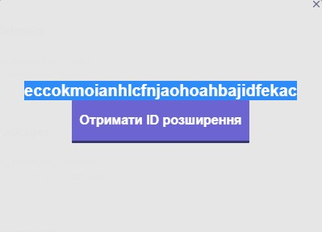

## Розширення для браузера на React

Проект студента ІО-92 Гуденка Євгенія

Розширення виводить власне ID при натисканні на кнопку

### Локальне тестування

`npm start`

Запускає розширення в режимі розробника. 
Відкрити [http://localhost:3000](http://localhost:3000) в браузері щоб побачити.

### Тестування через Хром

Цей проект повинен бути "збудованим", щоб використовувати переваги API Хрому для розширень, наприклад виконання скрипту для отримання ID розширення, що неможливо при запуску локально.

Щоб завантажити розширення в Хром:

1. `npm run build`  
2. Перейдіть до `chrome://extensions/` в браузері  
3. Активуйте вмикач `Режим розробника` в правому верхньому куті  
4. Натисніть на `Завантажити розпаковане розширення` в лівому верхньому куті  
5. Оберіть папку `Збудувати` всередині цього проекту  

